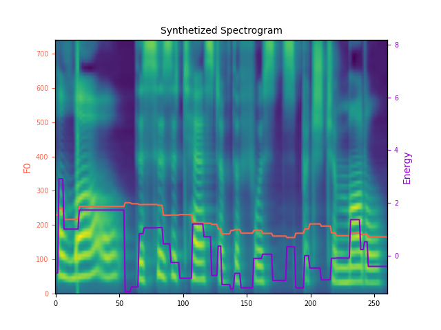
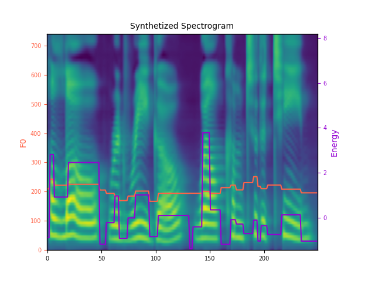
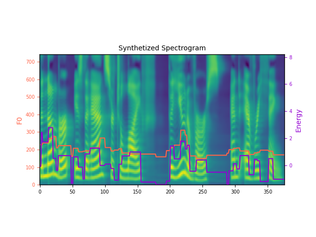

# Guía de Instalación y Uso de FastSpeech2

## Descripción
FastSpeech2 es un sistema de síntesis de voz (text-to-speech) que utiliza un modelo de aprendizaje profundo para generar voz natural a partir de texto. Esta implementación está basada en el [repositorio original de FastSpeech2](https://github.com/ming024/FastSpeech2) y ha sido adaptada para facilitar su uso y comprensión.

## Requisitos Previos
- Python 3.9 o superior
- pip (gestor de paquetes de Python)
- Git

## Pasos de Instalación

### 1. Clonar el Repositorio
```bash
git clone https://github.com/ming024/FastSpeech2.git
cd FastSpeech2
```

### 2. Crear y Activar Entorno Virtual
```bash
# Crear entorno virtual
python3 -m venv .venv

# Activar entorno virtual
# En macOS/Linux:
source .venv/bin/activate
# En Windows:
# .venv\Scripts\activate
```

### 3. Instalar Dependencias
```bash
# Instalar PyTorch
pip3 install torch torchaudio

# Instalar dependencias del proyecto
pip3 install -r requirements.txt

# Instalar NLTK y sus recursos
pip3 install nltk
python3 -c "import nltk; nltk.download('averaged_perceptron_tagger')"
```

### 4. Descargar Modelos Preentrenados

#### Modelo FastSpeech2 (LJSpeech - Inglés)
1. Descargar el modelo desde [este enlace](https://drive.google.com/file/d/1r3fYhnblBJ8hDKDSUDtidJ-BN-xAM9pe/view?usp=sharing)
2. Colocar el archivo en: `output/ckpt/LJSpeech/900000.pth.tar`

#### Vocoder HiFi-GAN
1. Descargar el vocoder desde [este enlace](https://drive.google.com/drive/folders/1-eEYTB5Av9jNql0WGBlRoi-WH2J7bp5Y?usp=sharing)
2. Seleccionar la carpeta `LJ_V1`
3. Extraer y colocar el archivo `generator_v1` como `hifigan/generator_LJSpeech.pth.tar`

## Estructura de Directorios
```
FastSpeech2/
├── .venv/                  # Entorno virtual
├── output/
│   └── ckpt/
│       └── LJSpeech/      # Modelo FastSpeech2
│           └── 900000.pth.tar
├── hifigan/
│   ├── config.json
│   └── generator_LJSpeech.pth.tar
├── config/
│   └── LJSpeech/
│       ├── preprocess.yaml
│       ├── model.yaml
│       └── train.yaml
└── synthesize.py
```

## Uso del Sistema

### Comando Básico de Síntesis
```bash
python3 synthesize.py --text "Tu texto aquí" --restore_step 900000 --mode single -p config/LJSpeech/preprocess.yaml -m config/LJSpeech/model.yaml -t config/LJSpeech/train.yaml
```

### Parámetros de Control
- `--pitch_control`: Controla el tono de la voz
  - Valores > 1.0: tono más alto
  - Valores < 1.0: tono más bajo
  - Ejemplo: `--pitch_control 1.2`

- `--energy_control`: Controla el volumen
  - Valores > 1.0: volumen más alto
  - Valores < 1.0: volumen más bajo
  - Ejemplo: `--energy_control 1.2`

- `--duration_control`: Controla la velocidad
  - Valores > 1.0: habla más lenta
  - Valores < 1.0: habla más rápida
  - Ejemplo: `--duration_control 0.8`

### Ejemplos de Uso

1. Síntesis básica:
```bash
python3 synthesize.py --text "Hello, this is a test." --restore_step 900000 --mode single -p config/LJSpeech/preprocess.yaml -m config/LJSpeech/model.yaml -t config/LJSpeech/train.yaml
```

2. Síntesis con voz más aguda y lenta:
```bash
python3 synthesize.py --text "Hello, this is a test." --pitch_control 1.2 --duration_control 1.2 --restore_step 900000 --mode single -p config/LJSpeech/preprocess.yaml -m config/LJSpeech/model.yaml -t config/LJSpeech/train.yaml
```

## Resultados

### Ejemplos de Síntesis
Aquí se muestran algunos ejemplos de la síntesis de voz generada:





## Salida
- Los archivos de audio generados se guardan en: `output/result/LJSpeech/`
- Cada síntesis genera:
  - Un archivo de audio (.wav)
  - Una imagen de la forma de onda
  - Una imagen del espectrograma

## Solución de Problemas

### Error de NLTK
Si encuentras errores relacionados con NLTK, asegúrate de:
1. Tener instalado NLTK: `pip3 install nltk`
2. Haber descargado el recurso necesario: `python3 -c "import nltk; nltk.download('averaged_perceptron_tagger')"`

### Error de Modelo no Encontrado
Verifica que:
1. El modelo FastSpeech2 esté en `output/ckpt/LJSpeech/900000.pth.tar`
2. El vocoder HiFi-GAN esté en `hifigan/generator_LJSpeech.pth.tar`

### Error de Dependencias
Si hay problemas con las dependencias:
1. Asegúrate de que el entorno virtual esté activado
2. Reinstala las dependencias: `pip3 install -r requirements.txt`

## Notas Adicionales
- El sistema está optimizado para inglés
- La calidad de la síntesis puede variar según el texto de entrada
- Se recomienda usar textos cortos para pruebas iniciales
- Los parámetros de control pueden ajustarse para personalizar la voz

## Recursos Adicionales
- [Repositorio Original de FastSpeech2](https://github.com/ming024/FastSpeech2)
- [Demo de FastSpeech2](https://cmchien.ttic.edu/FastSpeech2/)
- [Documentación de PyTorch](https://pytorch.org/docs/stable/index.html)

## Contribuciones
Las contribuciones son bienvenidas. Por favor, abre un issue para discutir los cambios propuestos o envía un pull request.

## Licencia
Este proyecto está basado en el [repositorio original de FastSpeech2](https://github.com/ming024/FastSpeech2) y se distribuye bajo la misma licencia.
